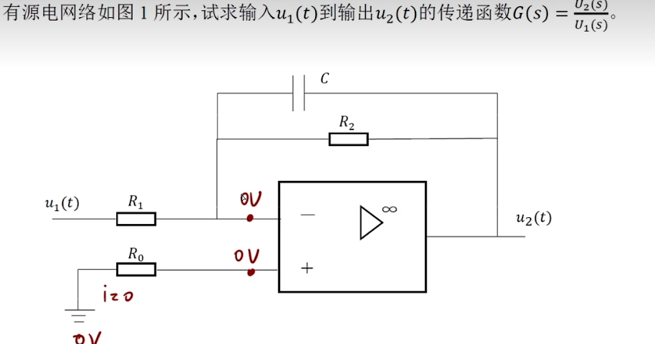
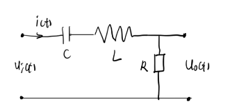
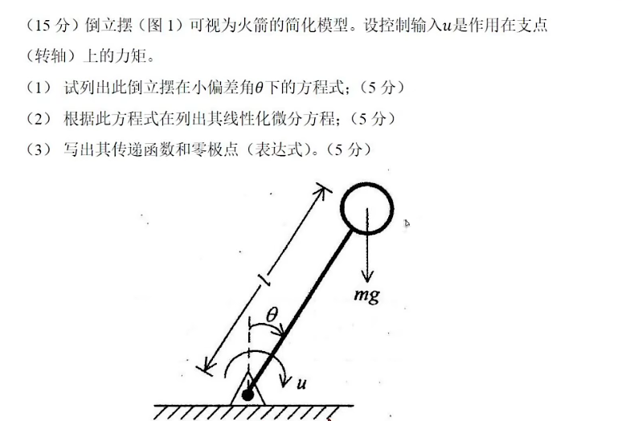
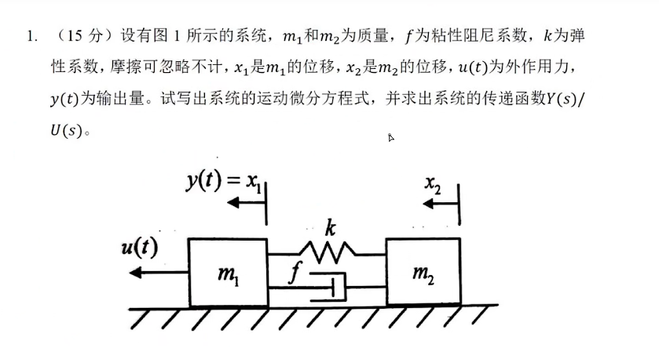

$i=\frac{u_1}{R_1}$

$i_c=C\frac{du}{dt}$

$i_{R_2}=\frac{u_2}{R_2}$

$i=-i_c-i_{R_2}$

$\frac{u_1}{R_1}=-C\frac{du_2}{dt}-\frac{u_2}{R_2}$

对两边进行Laplace

$\frac{U_1(s)}{R_1}=-CsU_2(s)-\frac{U_2(s)}{R_2}$

电容的阻抗为$\frac{U(s)}{I(s)}=\frac{1}{Cs}$

电感的阻抗为$\frac{U(s)}{I(s)}=Ls$

$G(s)=\frac{U_0(s)}{U_i(s)}=\frac{1}{Cs}+Ls+R$

$\Sigma M=J\alpha$

重力垂直于转轴上的力矩$M=mg\sin \theta l$

$\omega=\theta''$

$\Sigma M=u+mg\sin\theta l=ml^2\theta''$

由于偏差角很小

$\sin \theta =\theta$

$u+mg\theta l=ml^2\theta''$

对两边进行Laplace

$U(s)+mgl\theta(s)=ml^2 s^2\theta(s)$

$x_3=x_1-x_2$

$a_1=x_1''$

$a_2=x_2''$

$v_3=x_3'$

$y(t)=x_1$

弹簧和阻尼器为系统内力

$u(t)=m_1a_1+m_2a_2$

$kx_3+fv_3=m_2a_2$

带入得

$u(t)=m_1y(t)''+m_2x_2''$

$k[y(t)-x_2]+f(y(t)-x_2)'=m_2x_2''$

对两边进行Laplace

$U(s)=m_1s^2Y(s)+m_2s^2X(s)$

$k[Y(s)-X(s)]+sf[Y(s)-X(s)]=m_2s^2X(s)$

