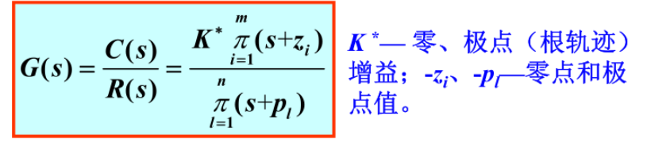

# 传递函数

## 定义
零初始条件下，系统输出量的拉氏变换与输入量变换之比

表达式为$G(s)=\frac{C(s)}{R(s)}$

## 三种表达式

- 一般表达式$G(s)=\frac{C(s)}{R(s)}=\frac{b_0s^m+b_1s^{m-1}\cdots +b_{m-1s}+b_m}{s^n+a_1s^{n-1}+\cdots+a_{n-1}s+a_n}$

- 时间常数表达式
  

- 零极点（根轨迹表达式）
  

## 基本性质

- 传递函数只适用于线性定常系统
- 传递函数是一种动态数学模型，取决于系统或元件的结构和参数，与输入量的形式（幅度和大小）无关，也不反应系统内部的任何信息
- 传递函数虽然描述了输入和输出之间的关系，许多不同的物理系统具有完全相同的传递函数，这就是系统的相似性
- 传递函数是在零初始条件下定义的，因此不能反映系统在非零初始条件下的运动规律
- 传递函数是复变量的有理帧分式，即n>=m,具有复变函数的所有性质。对于实际的系统而言，所有系数都为实数，在物理可实现的系统中，总是具有惯性且能量有限。
- 系统传递函数是其在单位脉冲响应的拉式变换

## 典型环节的传递函数

- 比例环节

    $G(s)=\frac{1}{s}$

- 积分环节
  
  特点：当输入消失，输出具有记忆功能，一般用于改善系统的稳态性能

- 微分环节

    理想微分：$G(s)=s$

    一阶微分：$G(s)=\tau s+1$

    - 特点：输出量正比于输入量变化的速度，具有超前控制的作用，一般用于改善系统的动态性能

- 惯性环节

    $G(s)=\frac{1}{Ts+1}$

    $T时间常数$

    - 特点：含有一个储能元件，对突变的输入，其输出不能立即复现

    - 实例：RC滤波电路网络，一阶水槽，直流伺服电动机的传递函数包含这一环节

- 震荡环节

    $G(s)=\frac{1}{T^2s^2+2\xi Ts+1}=\frac{\omega_n^2}{s^2+2\xi \omega_n s+\omega_n^2}$

    $\xi阻尼比$

    $T时间常数$

    $\omega_n无阻尼自然震荡角频率rad/s$

    - 特点：环节中有两个独立的储能元件，并可以进行能量交换，其输出出现震荡

    - 实例：RLC电路的输入与输出电压的传递函数

- 滞后环节

    $G(s)=e^{-\tau s}$

    $\tau 延时时间常数$

