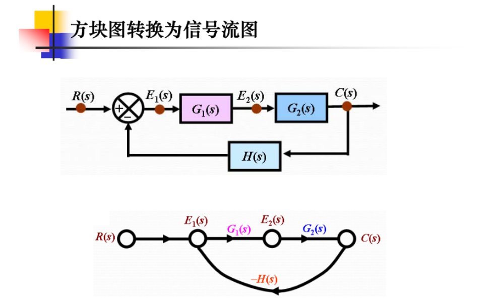
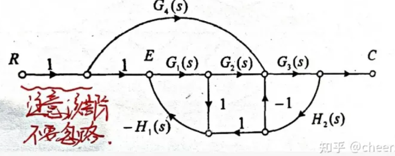
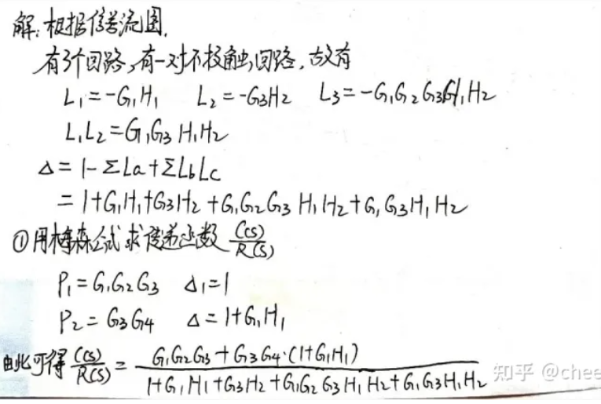

# 信号流图

# 梅森公式

## 典型例题

- 找出闭环回路(找反馈)
  - $L_1=-G_1H_1$
  - $L_2=-G_3H_2$
  - $L_3=-G_1G_2G_3H_2H_1$
- 判断两两不互相接触的回路
  - $L_1L_2=G_1G_3H_1H_2(两两不接触回路的乘积)$
- 套公式求传递函数分母
 
  $\sum L_a所有单独回路之和$

  $\sum L_bL_c所有两两不接触回路传递函数乘积之和$

  $\sum L_cL_dL_f所有三三互不接触回路传递函数乘积之和$

  $\Delta_k称为流余因子，等于流图特征式中去掉所有包含与第k条前向通道相接触的回路增益项后的剩余部$

  $\Delta=1-\sum L_a +\sum L_bL_c -\sum L_cL_dL_f(奇数是负偶数是正)$
    
  *根据公式带入*

  $\Delta=1+G_1H_1+G_3H_2+G_1G_2G_3H_2H_1+G_1G_3H_1H_2(传递函数分母)$

- 求传递函数的分子
   
   $分子为\sum P_i\Delta_i$

   $P_i两个节点之间第i条前向通路$

   $\Delta_i 流图余子式（与前面求\Delta 一样，只是回路为不与该前向通路接触的闭环回路）$

    $\Delta_i=1-\sum L_a +\sum L_bL_c -\sum L_cL_dL_f(奇数是负偶数是正)$

    *根据公式带入*

   $P_1=G_1G_2G_3$ 
   
   $\Delta_1=1（没有与该前向通道接触得回路）$

   $P_2=G_4G_3$ 
   
   $\Delta_2=1+G_1H_1$

   $\sum P_i\Delta_i=P_1\Delta_1+P_2\Delta_2$

- 得传递函数
  
    $G(s)=\frac{\sum P_i\Delta_i}{\Delta}$

## 做题规范

  