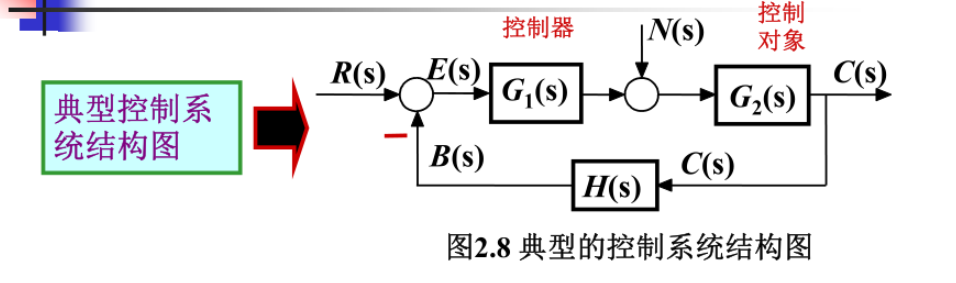
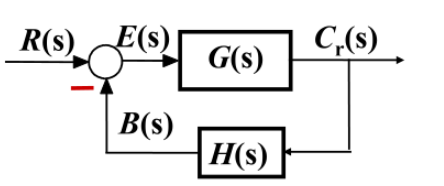
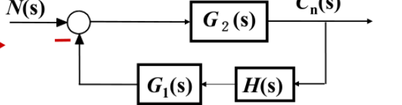
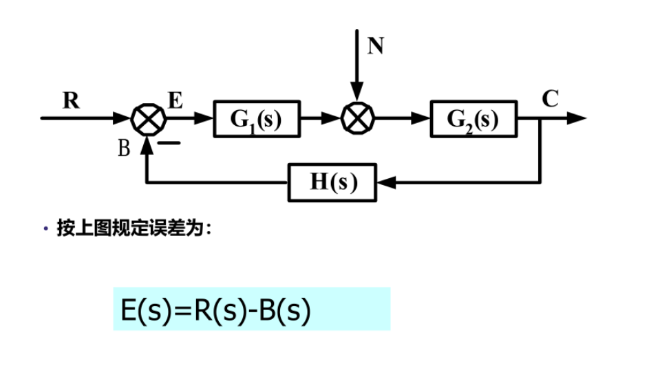
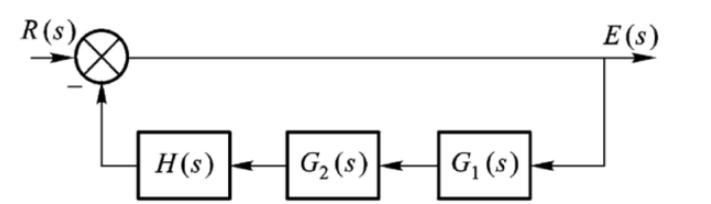
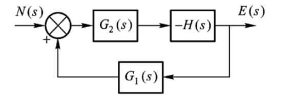

## 典型控制系统的结构图

以$R(s)$单独作用

- 前向通道：$E(s)\rightarrow C(s)$
  
  前向通道传递函数

  $\frac{C(s)}{E(s)}=G_1(s)G_2(s)$

- 反馈通道：$C(s)\rightarrow B(s)$

  $\frac{C(s)}{B(s)}=H(s)$
 
  $H(s)=1时称为单位负反馈$

- 开环通道：$E(s)\rightarrow B(s)$

  $\frac{B(s)}{E(s)}=G_1(s)G_2(s)H(s)=G(s)H(s)$

## 闭环传递函数

两种输入信号对输入响应的传递函数

- 控制传函：假定$N(s)=0,R(s)\rightarrow C_r(s)$

  化简控制结构图

  

  $G(s)=G_1(s)G_2(s)$

  $\Phi_r(s)=\frac{C_r(s)}{R(s)}=\frac{G(s)}{1+G(s)H(s)}=\frac{前向通道传函}{1+开环传函}$

- 扰动传函：假定$R(s)=0,N(s)\rightarrow C_n(s)$

  化简控制结构图

  

  $G(s)=G_1(s)G_2(s)$

  $\Phi_n(s)=\frac{C_n(s)}{N(s)}=\frac{G_2(s)}{1+G(s)H(s)}$

- 系统总响应：$C(s)=C_r(s)+C_n(s)$ 

## 闭环系统的误差传递函数

- $r(t)$作用下的系统误差传递函数$\Phi_{er}(s)$

    令$n(t)=0，求\Phi_{er}(s)$

    此时系统结构框图

    

    $\Phi_{er}(s)=\frac{E(s)}{R(s)}=\frac{1}{H(s)G_1(s)G_2(s)}$

- $n(t)$作用下的系统误差传递函数$\Phi_{en}(s)$

    令$n(t)=0，求\Phi_{er}(s)$

    此时系统结构框图

    

    $\Phi_{en}(s)=\frac{E(s)}{N(s)}=-\frac{G_2(s)H(s)}{1+H(s)G_1(s)G_2(s)}$

系统总误差

$E(s)=\Phi_{er}(s)R(s)+\Phi_{en}(s)N(s)$