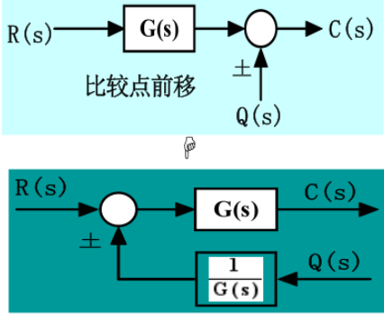
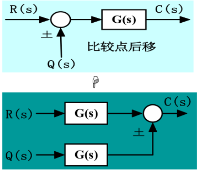
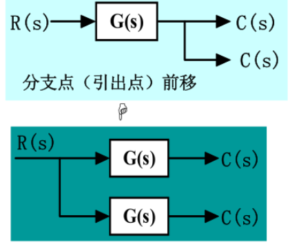
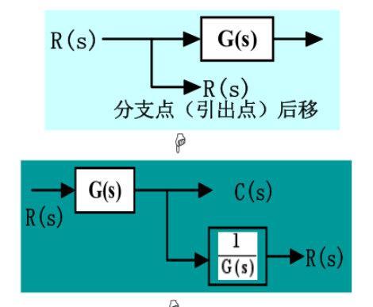
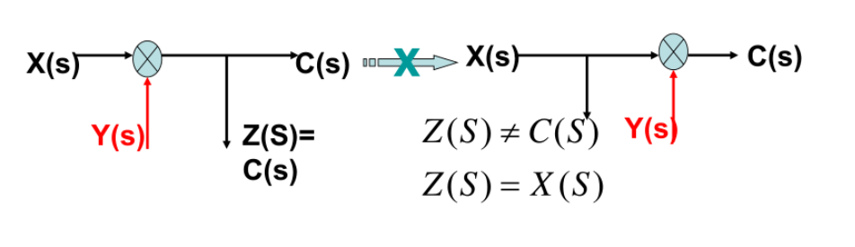
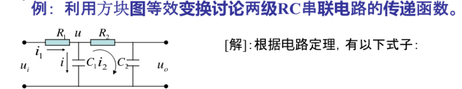

# 方框图的化简

## 三种基本组成形式

- 串联：传递函数等于所有传递函数都乘积
- 并联：代数和
- 反馈

## 比较点和分支点的移动

### 比较点

***前移乘以前一个传递函数的倒数***

***后移乘以后一个传递函数***

### 分支点

***前移乘以后一个传递函数***

***后移乘以前一个传递函数的倒数***

比较点和分支点正好相反

**注意**：比较点和分支点不能互相移动比较点和分支点不能互相移动

## 方框图求传递函数

就是先根据电路图求出各部分的传递函数，再画出框图，最后化简

## 方框图的化简
- 先将简单的串联并联化简
- 移动比较点或者引出点消除交错回路
  
> 如果存在多个输入量就先对每个输入量逐个化简
  
