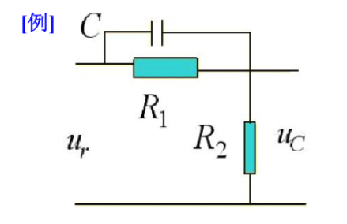
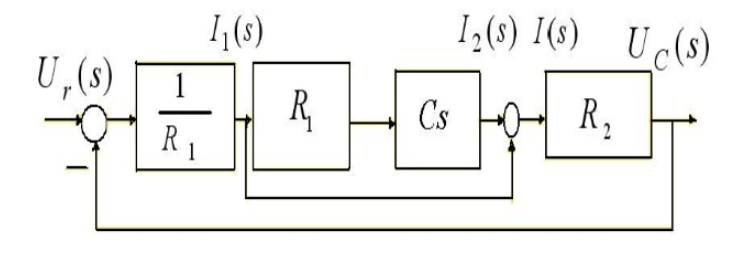
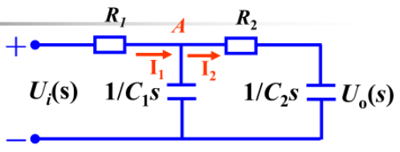
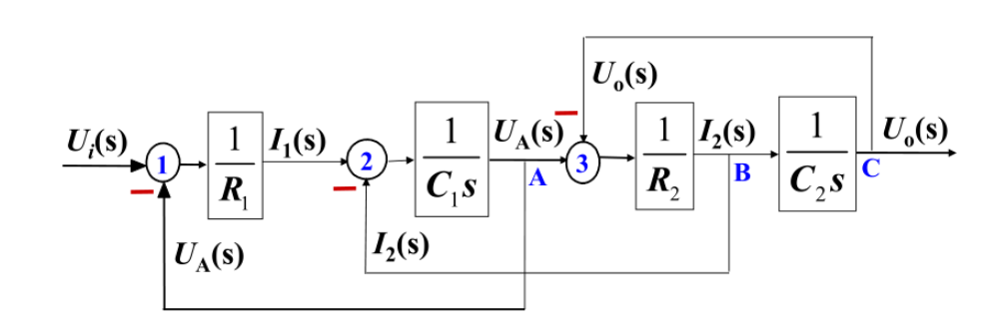

# 绘制系统结构图

- 确定输入输出
- 列写各环节微分方程
- 列写各环节的拉氏变换
- 根据信号流动方向画传递函数方框图
  

直接上例子

## 例1

$U_r(s)=I_1(s)R_1+U_c(s)\Rightarrow G_1(s)=\frac{I_1(s)}{U_r(s)-U_c(s)}=\frac{1}{R_1}存在负反馈，反馈量为U_c$

$U_c(s)=I(s)R_2\Rightarrow G_2(s)=\frac{U_c(s)}{IS(s)}=R_2$

$I_1(s)R_1=I_2(s)\frac{1}{Cs}\Rightarrow G_3(s)=\frac{I_2(s)}{I_1(s)}=R_1Cs$

$I_1(s)+I_2(s)=I(s)\Rightarrow G_4(s)=\frac{I(s)}{I_1(s)+I_2(s)}=1存在正反馈，反馈量为I_1$

## 例2

$I_1(s)=\frac{1}{R_1}[U_i(s)-U_A(s)]\Rightarrow G_1(s)=\frac{I_1(s)}{U_i(s)-U_A(s)}=\frac{1}{R_1}$

$U_A(s)=\frac{1}{C_1s}[I_1(s)-I_2(s)]\Rightarrow G_2(s)=\frac{U_A(s)}{I_1(s)-I_2(s)}=\frac{1}{C_1s}$

$U_A(s)-U_O(s)=I_2(s)R_2\Rightarrow G_3(s)=\frac{I_2(s)}{U_A(s)-UO(s)}=\frac{1}{R_2}$

$U_O(s)=I_2(s)\frac{1}{C_2s}\Rightarrow G_3(s)=\frac{U_O(s)}{I_2(s)}=\frac{1}{C_2s}$

