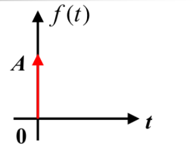
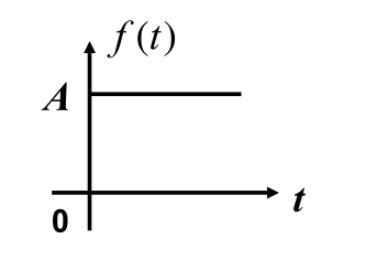
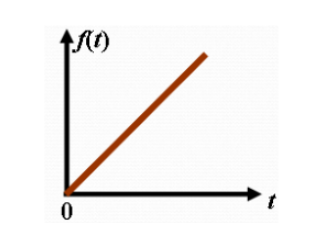
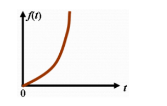
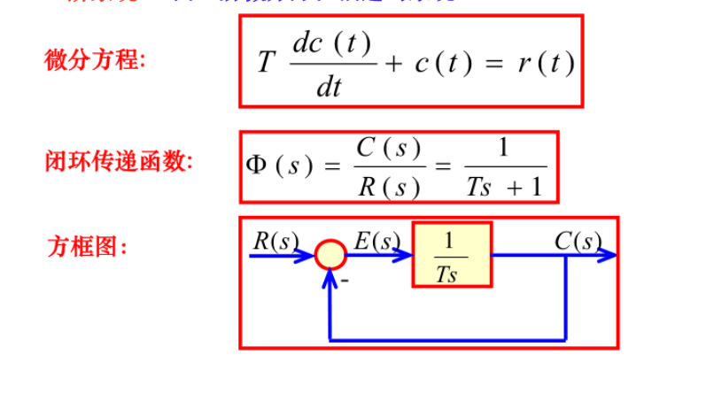
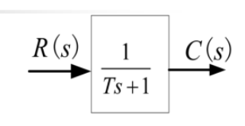
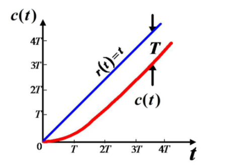
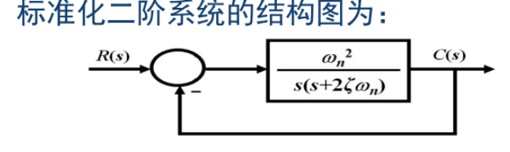
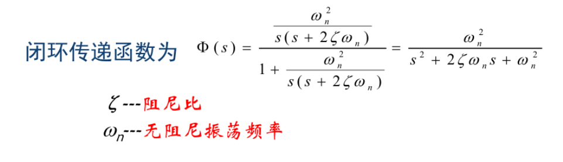

# 性能指标

## 分析方法
- 时域分析-> 瞬态性能
- 根轨迹 -> 稳态性能
- 频率特性 -> 稳定性

## 典型输入信号

### 冲激函数

$f(t)=A\cdot\delta(t)=\left\{\begin{matrix}
 0\qquad t\neq0\\ 
 \infin\qquad t=0  
\end{matrix}\right.$

$\int_{-\infin}^{+\infin}f(t)dt=A$

$单位脉冲A=1$

*采样性*
$\int_{-\infin}^{+\infin}f(t-t_1)dt=f(t_1)$

### 阶跃信号

$f(t)=A\cdot (t)=\left\{\begin{matrix}
 0\qquad t<0\\ 
 A\qquad t\geq0  
\end{matrix}\right.$

$单位阶跃函数A=1$

### 斜坡函数

$f(t)=\left\{\begin{matrix}
 0\qquad t<0\\ 
 At\qquad t\geq0  
\end{matrix}\right.$

### 抛物线函数

$f(t)=\left\{\begin{matrix}
 0\qquad t<0\\ 
 \frac{1}{2}At^2\qquad t\geq0  
\end{matrix}\right.$

## 一阶系统

### 阶跃响应

$C\left(s\right)=\ \Phi\left(s\right)\cdot R\left(s\right)=\frac{1}{T s\ +1}\cdot\frac{1}{s}\ =\ \frac{1}{s}-\frac{1}{s+1/T}$

$c(t)=L^{-1}[C(s)]=1-e^{-\frac{t}{T}},(t\geq0)$

$1稳态分量$

$-e^{-\frac{t}{T}}暂态分量$

### 斜坡响应

$C(s)=\frac{1}{Ts+1}\cdot\frac{1}{s^2}=\frac{1}{s^2}-\frac{T}{s}+\frac{T^2}{Ts+1}$

$输出响应c(t)=t-T+Te^{-\frac{t}{T}}=t-T(1-e^{-\frac{t}{T}})$

$误差e(t)=r(t)-c(t)=T(1-e^{-\frac{t}{T}})$

## 二阶系统

